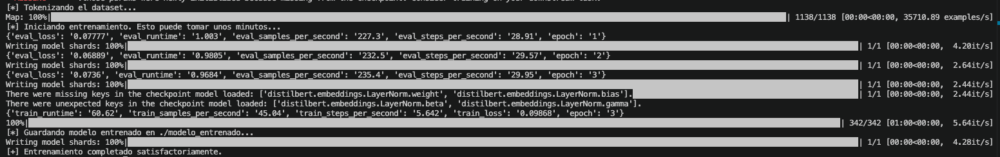
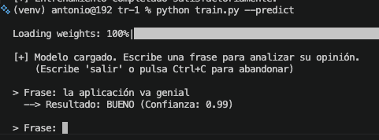
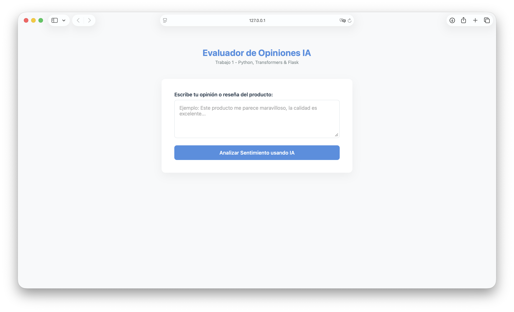
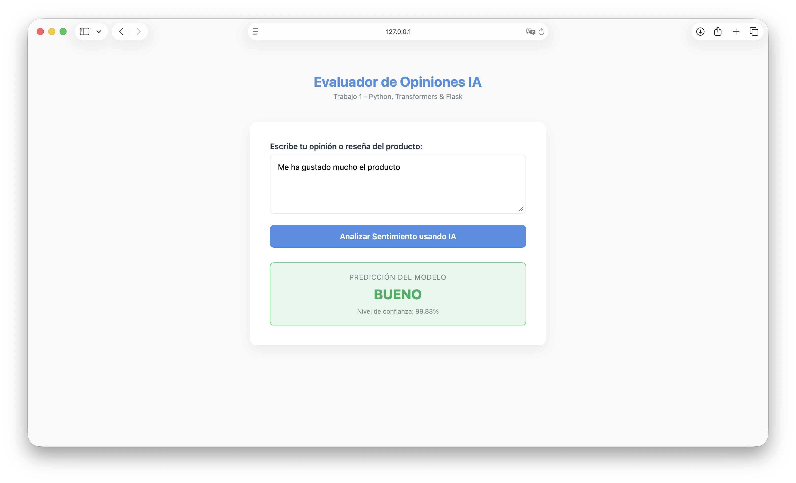
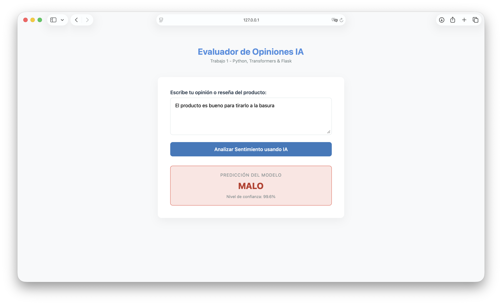

# Trabajo 1 — Sistema de Análisis de Opinión de Productos

> **Asignatura:** Negocio Electrónico · Prof. Torres Arriaza  
> **Grupo:** Antonio & Raúl  
> **Tecnologías:** Python · Flask · Transformers (HuggingFace) · DistilBERT

---

## Descripción

Sistema de análisis de sentimiento que clasifica opiniones de productos en dos categorías:
- **bueno** — opinión positiva
- **malo** — opinión negativa

El sistema utiliza el modelo preentrenado `distilbert-base-multilingual-cased` de HuggingFace, afinado con un dataset personalizado de reseñas en español. Ofrece dos interfaces: una aplicación web con Flask y un modo interactivo por línea de comandos.

```
Usuario
  │
  ├──▶ Interfaz web (Flask :7860)
  │       │
  │       ▼
  │    Modelo DistilBERT ──▶ bueno / malo + confianza
  │
  └──▶ CLI interactivo (train.py --predict)
          │
          ▼
       Modelo DistilBERT ──▶ BUENO / MALO + confianza
```

---

## Estructura del proyecto

| Archivo | Descripción |
|---|---|
| `train.py` | Script de entrenamiento del modelo y modo interactivo CLI |
| `app.py` | Aplicación web Flask para clasificar opiniones |
| `templates/index.html` | Interfaz web HTML/CSS |
| `dataset.txt` | Dataset de entrenamiento (60 frases etiquetadas) |
| `requirements.txt` | Dependencias de Python |
| `Dockerfile` | Contenedorización del proyecto |
| `modelo_entrenado/` | Modelo afinado (generado tras el entrenamiento) |

---

## Instalación

```bash
# Crear entorno virtual
python3 -m venv venv
source venv/bin/activate

# Instalar dependencias
pip install -r requirements.txt
```

---

## Archivo de datos

Cada línea del archivo `dataset.txt` sigue el formato:

```
<frase> # <etiqueta>
```

Etiquetas posibles: `bueno`, `malo`.

**Ejemplo:**
```
Este producto es una maravilla, me ha encantado#bueno
La verdad es que es una porquería, se rompió al primer día#malo
```

El dataset contiene 60 frases balanceadas (30 positivas y 30 negativas) sobre productos variados.

---

## Uso

### 1. Entrenar el modelo

```bash
python train.py --train dataset.txt
```

El modelo se entrena durante 3 épocas con split 80/20 y se guarda en `modelo_entrenado/`.



### 2. Modo interactivo CLI

```bash
python train.py --predict
```

Permite escribir frases por teclado y recibir la clasificación en tiempo real.



### 3. Aplicación web

```bash
python app.py
```

Abrir en el navegador: `http://127.0.0.1:7860`



---

## Demostración

### Interfaz web — opinión positiva

Se introduce una reseña positiva y el sistema la clasifica como **bueno** con su porcentaje de confianza:



### Interfaz web — opinión negativa

Se introduce una reseña negativa y el sistema la clasifica como **malo**:



---

## Modelo y entrenamiento

| Parámetro | Valor |
|---|---|
| Modelo base | `distilbert-base-multilingual-cased` |
| Épocas | 3 |
| Batch size | 8 |
| Learning rate | 2e-5 |
| Max length | 128 tokens |
| Split train/test | 80/20 |
| Estrategia de evaluación | Por época |
| Mejor modelo | Selección automática |

---

## Docker

El proyecto incluye un `Dockerfile` que entrena el modelo durante la construcción:

```bash
docker build -t tr1-opinion .
docker run -p 7860:7860 tr1-opinion
```

---

## Diagrama de tareas

| Tarea | Responsable |
|---|---|
| Configuración del entorno y dependencias | Antonio |
| Diseño del dataset de entrenamiento (60 frases) | Antonio & Raúl |
| Script de entrenamiento con Transformers (`train.py`) | Antonio |
| Modo interactivo CLI (`train.py --predict`) | Antonio |
| Aplicación web Flask (`app.py`) | Raúl |
| Interfaz HTML/CSS (`templates/index.html`) | Raúl |
| Dockerfile para contenedorización | Antonio |
| Documentación y capturas | Antonio & Raúl |

---

## Prompts usados con IA

> Herramienta utilizada: **Claude (Anthropic)** — claude.ai

| # | Prompt |
|---|---|
| 1 | `Crea un sistema de análisis de opiniones de productos usando transformers y flask` |
| 2 | `Genera un dataset de 60 frases en español balanceado entre opiniones buenas y malas` |
| 3 | `Añade un modo interactivo por consola para probar el modelo sin levantar Flask` |
| 4 | `Crea un Dockerfile que entrene el modelo y sirva la app` |
| 5 | `Haz un README para entregar esta actividad` |

---

## Referencias

- HuggingFace Transformers: https://huggingface.co/docs/transformers
- DistilBERT multilingual: https://huggingface.co/distilbert-base-multilingual-cased
- Flask: https://flask.palletsprojects.com/
- Docker: https://docs.docker.com/

---

## Capturas necesarias

> Las siguientes imágenes deben guardarse en la carpeta `img/` del repositorio:

| Nombre del fichero | Qué debe mostrar |
|---|---|
| `img/entrenamiento.png` | Terminal mostrando la salida de `python train.py --train dataset.txt` (progreso de épocas, métricas) |
| `img/cli_predict.png` | Terminal con el modo interactivo: una frase positiva y una negativa clasificadas |
| `img/web_interfaz.png` | Navegador mostrando la interfaz web vacía (formulario sin rellenar) |
| `img/web_resultado_bueno.png` | Navegador mostrando un resultado positivo (verde, "bueno", con confianza) |
| `img/web_resultado_malo.png` | Navegador mostrando un resultado negativo (rojo, "malo", con confianza) |
