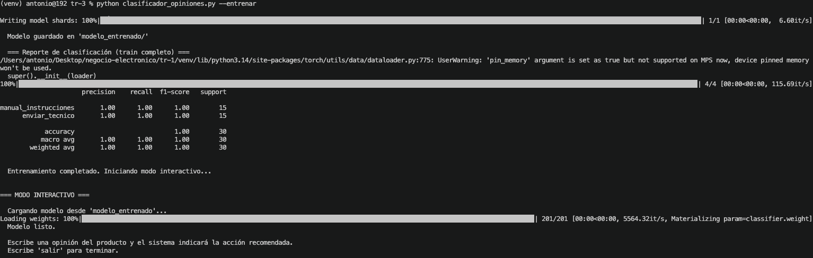
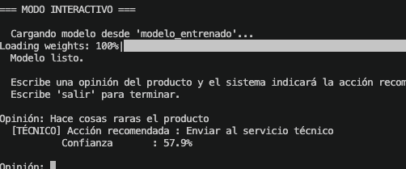
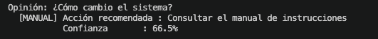
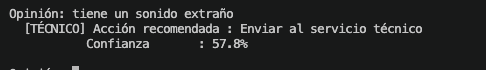

# Trabajo 3 — Clasificador de Opiniones de Productos (Manual vs Técnico)

> **Asignatura:** Negocio Electrónico · Prof. Torres Arriaza  
> **Grupo:** Antonio & Raúl  
> **Tecnologías:** Python · Transformers (HuggingFace) · BERT en español · PyTorch

---

## Descripción

Sistema de clasificación de opiniones de productos que recomienda una acción de mantenimiento según la descripción del problema:

- **manual_instrucciones** — el usuario puede resolver el problema consultando el manual
- **enviar_tecnico** — el producto necesita revisión por un técnico especializado

Utiliza el modelo `dccuchile/bert-base-spanish-wwm-cased` (BERT entrenado específicamente con textos en español) afinado con un dataset de 30 opiniones etiquetadas.

```
Usuario escribe opinión
        │
        ▼
  BERT español (afinado)
        │
        ├──▶ [MANUAL]   → "Consultar el manual de instrucciones"
        └──▶ [TÉCNICO]  → "Enviar al servicio técnico"
        
        + porcentaje de confianza
```

---

## Estructura del proyecto

| Archivo | Descripción |
|---|---|
| `clasificador_opiniones.py` | Script principal: entrenamiento + modo interactivo |
| `datos_entrenamiento.txt` | Dataset de 30 opiniones etiquetadas |
| `requirements.txt` | Dependencias de Python |
| `modelo_entrenado/` | Modelo afinado (generado tras el entrenamiento) |

---

## Instalación

```bash
# Crear entorno virtual
python3 -m venv venv
source venv/bin/activate

# Instalar dependencias
pip install -r requirements.txt
```

---

## Archivo de datos

Cada línea del archivo `datos_entrenamiento.txt` sigue el formato:

```
<frase>#<etiqueta>
```

Separadores soportados: `#`, `;`, `|`, tabulador.  
Las líneas que empiecen con `#` se tratan como comentarios.

**Ejemplo:**
```
No sé cómo configurar la pantalla inicial#manual_instrucciones
El motor hace un sonido raro y huele a quemado#enviar_tecnico
```

El dataset contiene 30 frases balanceadas (15 de cada categoría):
- **manual_instrucciones**: dudas sobre configuración, idioma, WiFi, temporizadores, firmware...
- **enviar_tecnico**: daños físicos, sonidos extraños, chispas, líquidos, piezas rotas...

---

## Uso

### 1. Entrenar y luego usar el modo interactivo

```bash
python clasificador_opiniones.py --entrenar
```



### 2. Entrenar con un archivo personalizado y más épocas

```bash
python clasificador_opiniones.py --entrenar --archivo mis_datos.txt --epocas 10
```

### 3. Solo modo interactivo (modelo ya entrenado)

```bash
python clasificador_opiniones.py
```



---

## Demostración

### Clasificación tipo "manual"

Se introduce una frase sobre una duda de configuración y el sistema recomienda consultar el manual:



### Clasificación tipo "técnico"

Se introduce una frase sobre un daño físico y el sistema recomienda enviar al servicio técnico:



---

## Modelo y entrenamiento

| Parámetro | Valor |
|---|---|
| Modelo base | `dccuchile/bert-base-spanish-wwm-cased` |
| Épocas | 5 (por defecto) |
| Batch size | 8 |
| Max length | 128 tokens |
| Warmup steps | 10 |
| Weight decay | 0.01 |
| Split train/validación | 80/20 (estratificado) |
| Evaluación | Por época |
| Mejor modelo | Selección automática por accuracy |

### Resultados del entrenamiento

```
  Train: 24 | Validación: 6
  Accuracy final: 100.00%

                      precision    recall  f1-score   support

manual_instrucciones       1.00      1.00      1.00        15
      enviar_tecnico       1.00      1.00      1.00        15

            accuracy                           1.00        30
```


---

## Diagrama de tareas

| Tarea | Responsable |
|---|---|
| Configuración del entorno y dependencias | Antonio |
| Diseño del dataset de entrenamiento (30 frases) | Antonio & Raúl |
| Implementación del clasificador con BERT español | Antonio |
| Lectura flexible de datos (múltiples separadores) | Antonio |
| Entrenamiento y evaluación del modelo | Raúl |
| Modo interactivo con mensajes amigables | Raúl |
| Documentación y capturas | Antonio & Raúl |

---

## Prompts usados con IA

> Herramienta utilizada: **Claude (Anthropic)** — claude.ai

| # | Prompt |
|---|---|
| 1 | `Crea un clasificador de opiniones de productos con transformers que clasifique en manual_instrucciones o enviar_tecnico` |
| 2 | `Usa el modelo BERT en español (dccuchile) en lugar de uno multilingüe` |
| 3 | `Genera un dataset de 30 frases balanceadas entre las dos categorías` |
| 4 | `Añade soporte para múltiples separadores en el archivo de datos` |
| 5 | `Haz un README para entregar esta actividad` |

---

## Notas

- Se necesita conexión a Internet la primera vez para descargar el modelo base.
- El modelo entrenado se guarda en `modelo_entrenado/`.
- El modelo base (`dccuchile/bert-base-spanish-wwm-cased`) pesa ~420 MB.

---

## Referencias

- BERT español (BETO): https://github.com/dccuchile/beto
- HuggingFace Transformers: https://huggingface.co/docs/transformers
- Scikit-learn (métricas): https://scikit-learn.org/stable/modules/model_evaluation.html
- PyTorch: https://pytorch.org/docs/stable/

---

## Capturas necesarias

> Las siguientes imágenes deben guardarse en la carpeta `img/` del repositorio:

| Nombre del fichero | Qué debe mostrar |
|---|---|
| `img/entrenamiento.png` | Terminal mostrando la salida del entrenamiento (épocas, métricas de accuracy) |
| `img/reporte_clasificacion.png` | Terminal con el reporte de clasificación completo (precision, recall, f1-score) |
| `img/modo_interactivo.png` | Terminal con el modo interactivo arrancado y listo para recibir frases |
| `img/resultado_manual.png` | Terminal mostrando una clasificación `[MANUAL]` con su confianza |
| `img/resultado_tecnico.png` | Terminal mostrando una clasificación `[TÉCNICO]` con su confianza |
