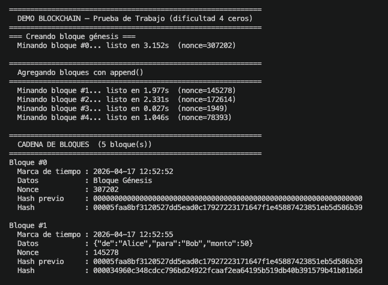
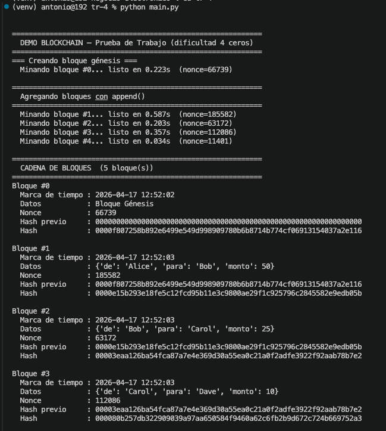
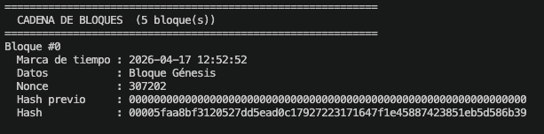
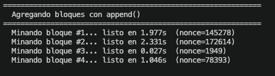
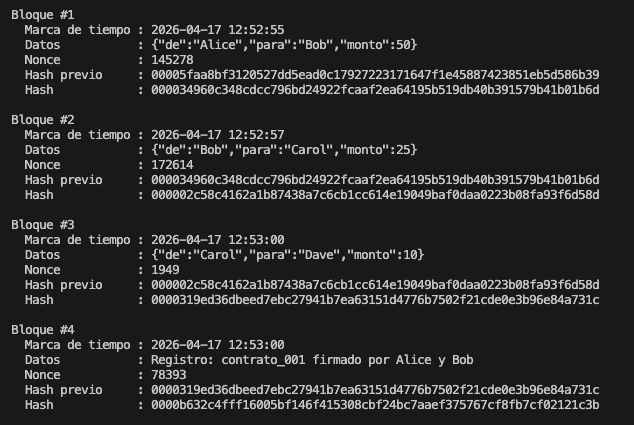
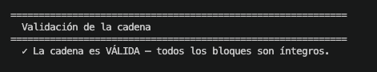
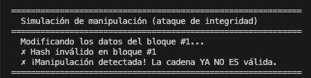

# Trabajo 4 — Prototipo de DLT (Blockchain)

> **Asignatura:** Negocio Electrónico · Prof. Torres Arriaza  
> **Grupo:** Antonio & Raúl  
> **Tecnologías:** Python · Rust · SHA-256 · Proof of Work

---

## Descripción

Prototipo funcional de una cadena de bloques (Distributed Ledger Technology) que implementa tres conceptos fundamentales:

1. **Operación append** — añadir bloques secuencialmente a la cadena
2. **Prueba de trabajo (Proof of Work)** — minado con dificultad de 4 ceros (`0000...`)
3. **Sistema de marcas de tiempo** — cada bloque registra su timestamp UNIX

El proyecto incluye una implementación en **Python** (versión original) y un port a **Rust** (versión de rendimiento).

```
Bloque Génesis (#0)       Bloque #1              Bloque #2
┌──────────────────┐    ┌──────────────────┐    ┌──────────────────┐
│ hash_previo: 000…│    │ hash_previo: ←───┼────│ hash: 0000abc…   │
│ datos: Génesis   │    │ datos: Alice→Bob │    │ datos: Bob→Carol │
│ nonce: 47281     │    │ nonce: 12093     │    │ nonce: 58412     │
│ hash: 0000abc… ──┼───▶│ hash: 0000def… ──┼───▶│ hash: 0000ghi…   │
│ timestamp: ...   │    │ timestamp: ...   │    │ timestamp: ...   │
└──────────────────┘    └──────────────────┘    └──────────────────┘
```

---

## Estructura del proyecto

| Archivo | Descripción |
|---|---|
| `blockchain.py` | Implementación de la blockchain en Python |
| `main.py` | Demo completa en Python |
| `src/blockchain.rs` | Implementación de la blockchain en Rust |
| `src/main.rs` | Demo completa en Rust |
| `Cargo.toml` | Configuración del proyecto Rust |

---

## Uso

### Versión Rust (recomendada)

```bash
cargo run
```



### Versión Python

```bash
python main.py
```



---

## Demostración

La demo ejecuta 5 fases automáticamente:

### 1. Creación del bloque génesis

Se genera el primer bloque de la cadena con hash previo de 64 ceros. El minado busca un nonce que produzca un hash SHA-256 que comience con `0000`.



### 2. Append de bloques con transacciones

Se añaden 4 bloques con datos variados (transacciones JSON y registros de texto):

```
Alice → Bob:   50
Bob   → Carol: 25
Carol → Dave:  10
Registro: contrato_001 firmado por Alice y Bob
```



### 3. Visualización de la cadena completa

Se muestra cada bloque con su índice, timestamp, datos, nonce, hash previo y hash:



### 4. Validación de integridad

Se recorre la cadena verificando que cada hash cumple la Proof of Work y que los eslabones son coherentes:



### 5. Simulación de ataque de integridad

Se modifican los datos del bloque #1 (Alice→Eve, monto 9999) y se re-valida. La cadena detecta la manipulación:



---

## Implementación

### Proof of Work

El algoritmo de minado incrementa un `nonce` hasta encontrar un hash SHA-256 que comience con 4 ceros:

```python
while not hash_candidato.startswith("0000"):
    self.nonce += 1
    hash_candidato = self._calcular_hash()
```

### Hash del bloque

Se calcula el SHA-256 sobre un JSON ordenado con los campos del bloque:

```python
contenido = json.dumps({
    "indice": self.indice,
    "marca_tiempo": self.marca_tiempo,
    "datos": self.datos,
    "hash_previo": self.hash_previo,
    "nonce": self.nonce,
}, sort_keys=True)
return hashlib.sha256(contenido.encode()).hexdigest()
```

### Validación

Se comprueban tres condiciones para cada bloque:
1. El hash recalculado coincide con el almacenado
2. El hash cumple la prueba de trabajo (empieza por `0000`)
3. El `hash_previo` coincide con el hash del bloque anterior

---

## Dependencias Rust (Cargo.toml)

```toml
sha2 = "0.10"       # SHA-256
serde_json = "1.0"   # Serialización JSON
chrono = "0.4"       # Timestamps legibles
```

---

## Diagrama de tareas

| Tarea | Responsable |
|---|---|
| Diseño de la estructura de bloques y cadena | Antonio |
| Implementación de Proof of Work (SHA-256 + 4 ceros) | Antonio |
| Sistema de marcas de tiempo | Antonio |
| Operación append y validación de integridad | Antonio |
| Implementación Python (`blockchain.py`, `main.py`) | Antonio |
| Port a Rust (`blockchain.rs`, `main.rs`) | Raúl |
| Demo de simulación de ataque | Raúl |
| Documentación y capturas | Antonio & Raúl |

---

## Prompts usados con IA

> Herramienta utilizada: **Claude (Anthropic)** — claude.ai

| # | Prompt |
|---|---|
| 1 | `Desarrollo de un prototipo de DLT (blockchain) con la operación append, una prueba simple de trabajo y un sistema de marca de tiempo. 4 ceros para el hash de los bloques. Desarrollo en Python.` |
| 2 | `¿Puedes pasar el código a Rust mejor?` |
| 3 | `Añade una demo que simule un ataque de integridad modificando un bloque` |
| 4 | `Haz un README para entregar esta actividad` |

---

## Referencias

- SHA-256 — NIST FIPS 180-4: https://csrc.nist.gov/publications/detail/fips/180/4/final
- Bitcoin Whitepaper (Proof of Work): https://bitcoin.org/bitcoin.pdf
- Rust `sha2` crate: https://docs.rs/sha2/latest/sha2/
- Python `hashlib`: https://docs.python.org/3/library/hashlib.html

---

## Capturas necesarias

> Las siguientes imágenes deben guardarse en la carpeta `img/` del repositorio:

| Nombre del fichero | Qué debe mostrar |
|---|---|
| `img/cargo_run.png` | Terminal mostrando `cargo run` completo (compilación + ejecución de la demo) |
| `img/python_run.png` | Terminal mostrando `python main.py` completo |
| `img/bloque_genesis.png` | Minado del bloque génesis (nonce encontrado, tiempo) |
| `img/append_bloques.png` | Minado de los 4 bloques con transacciones |
| `img/cadena_completa.png` | Impresión de la cadena con todos los bloques (índice, hash, datos, timestamp) |
| `img/validacion_ok.png` | Mensaje de validación exitosa: "La cadena es VÁLIDA" |
| `img/manipulacion_detectada.png` | Mensaje de manipulación detectada: "La cadena YA NO ES válida" |
