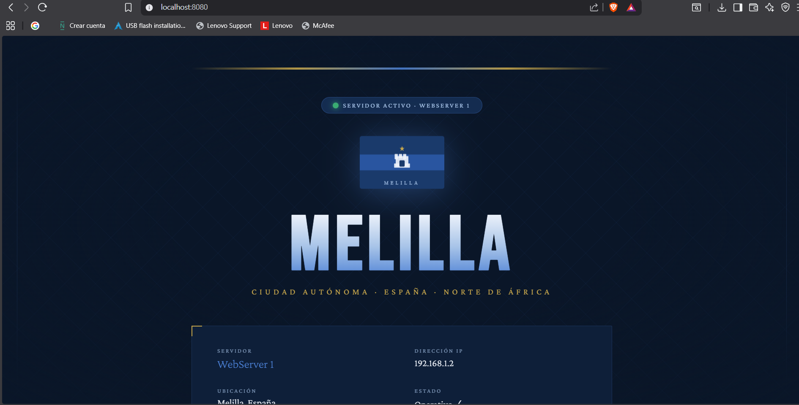
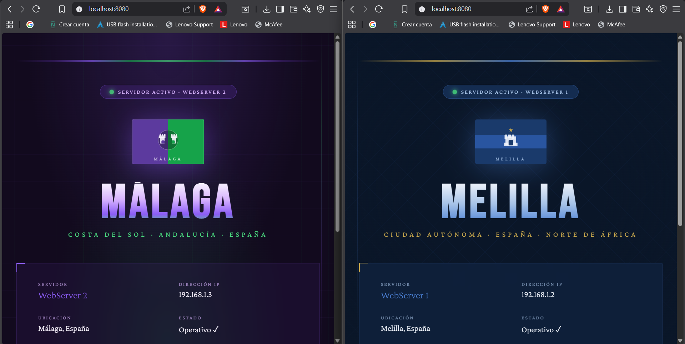
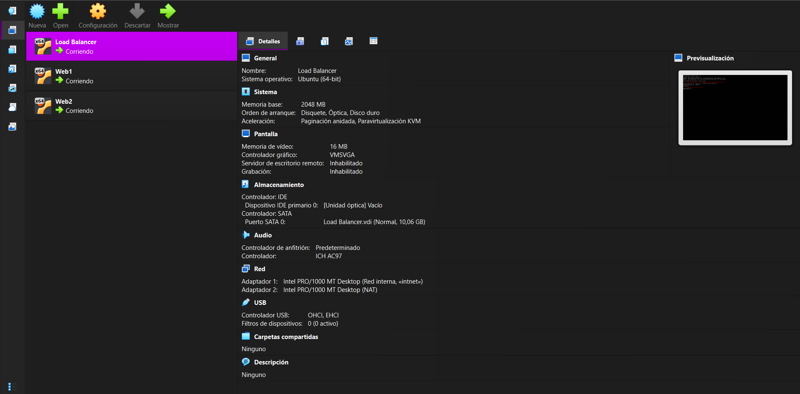
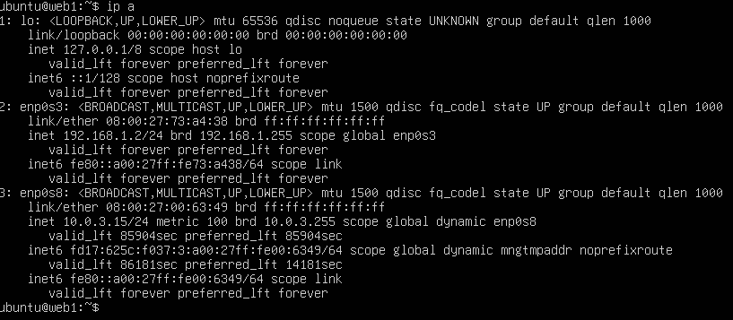
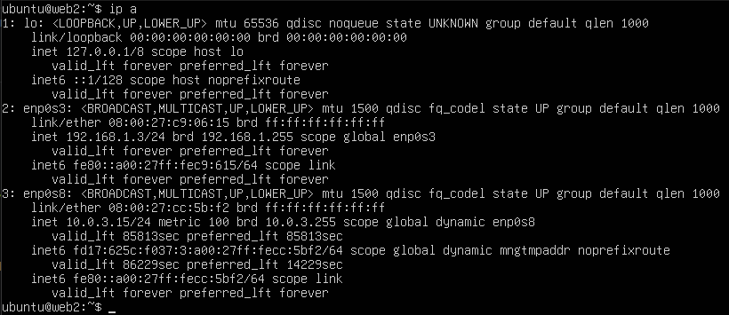
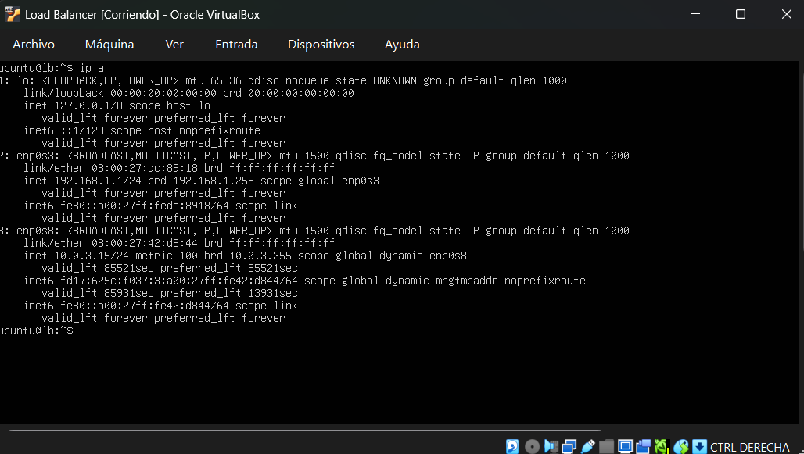
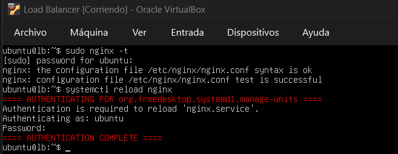
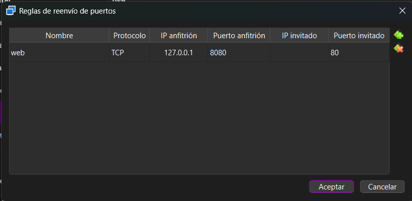
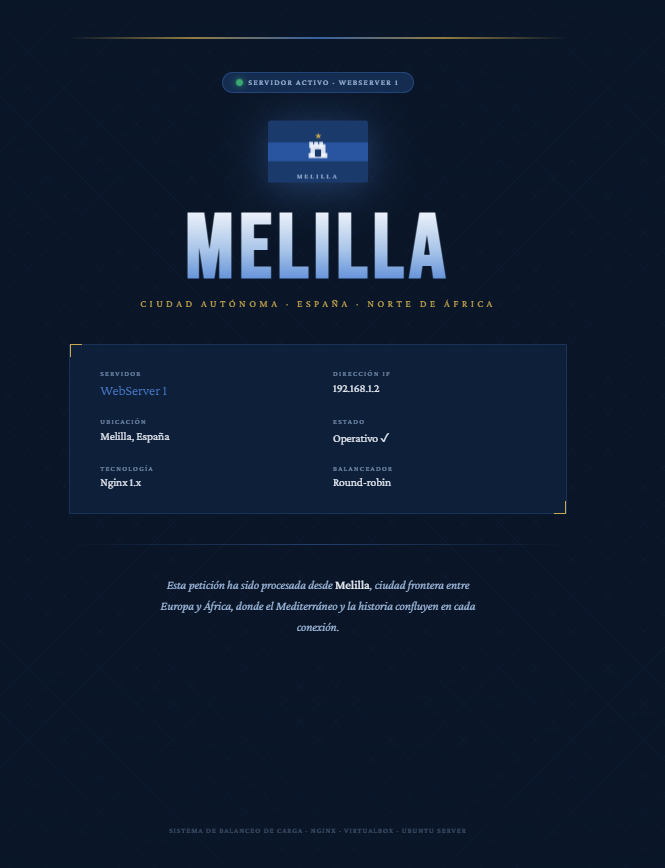

# Trabajo 6 — Sistema de Balanceo de Carga entre Servidores Web

> **Asignatura:** Negocio Electrónico · Prof. Torres Arriaza  
> **Grupo:** Antonio & Raúl  
> **Tecnologías:** Nginx · Oracle VirtualBox · Ubuntu Server 22.04

---

## Descripción

Sistema de balanceo de carga que distribuye peticiones HTTP entre dos servidores web mediante **Nginx** como proxy inverso con algoritmo round-robin. El usuario accede a través del navegador y, al refrescar, el sistema le sirve alternativamente desde WebServer1 (Melilla) o WebServer2 (Málaga).

```
Usuario (navegador)
       │
       ▼
  LoadBalancer :80  (192.168.1.1)
  ┌─────────────────────────────┐
  │   Nginx · round-robin       │
  └────────────┬────────────────┘
       ┌───────┴────────┐
       ▼                ▼
  WebServer1       WebServer2
  192.168.1.2      192.168.1.3
   (Melilla)        (Málaga)
```

---

## Arquitectura

| Máquina | IP interna | Rol |
|---|---|---|
| LoadBalancer | 192.168.1.1 | Proxy inverso Nginx + NAT hacia el host |
| WebServer1 | 192.168.1.2 | Servidor web Nginx — Melilla |
| WebServer2 | 192.168.1.3 | Servidor web Nginx — Málaga |

Todas las VMs corren **Ubuntu Server 22.04 LTS** sobre **Oracle VirtualBox** con red interna (`intnet`). El LoadBalancer tiene adicionalmente un adaptador NAT para hacer port-forwarding desde el host.

---

## Demostración

Al acceder a `http://localhost:8080` y refrescar, el balanceador alterna entre los dos servidores:

| WebServer1 — Melilla | WebServer2 — Málaga |
|---|---|
|  |  |

Comportamiento del balanceo observado en el navegador al refrescar:



---

## Configuración de la red

Las tres VMs se ven entre sí a través de la red interna de VirtualBox:



Salida de `ip a` en cada máquina confirmando las IPs asignadas:

| WebServer1 | WebServer2 | LoadBalancer |
|---|---|---|
|  |  |  |

---

## Configuración Nginx — LoadBalancer

Fichero `/etc/nginx/sites-available/loadbalancer`:

```nginx
upstream backend {
    server 192.168.1.2;  # WebServer1 - Melilla
    server 192.168.1.3;  # WebServer2 - Málaga
}

server {
    listen 80;
    location / {
        proxy_pass http://backend;
    }
}
```

Nginx utiliza **round-robin** por defecto: cada nueva petición se envía al siguiente servidor de la lista de forma cíclica.

Verificación de sintaxis y recarga:



---

## Port-forwarding VirtualBox

Para acceder desde el navegador del host se configuró la siguiente regla en el adaptador NAT del LoadBalancer:

| Nombre | Protocolo | IP host | Puerto host | Puerto invitado |
|---|---|---|---|---|
| web | TCP | 127.0.0.1 | 8080 | 80 |



---

## Páginas web de cada servidor

Cada servidor tiene una página HTML personalizada que identifica visualmente desde qué nodo se está sirviendo la petición.

**WebServer1 — Melilla** (azul marino, bandera de Melilla):



**WebServer2 — Málaga** (morado y verde, colores de Málaga):


---

## Diagrama de tareas

| Tarea | Responsable |
|---|---|
| Creación y configuración de las VMs en VirtualBox | Antonio |
| Configuración de red interna (netplan, IPs estáticas) | Antonio |
| Instalación y configuración de Nginx en WebServer1 | Antonio |
| Instalación y configuración de Nginx en WebServer2 | Raúl |
| Configuración del LoadBalancer (upstream + proxy_pass) | Raúl |
| Desarrollo de las páginas HTML personalizadas (Melilla / Málaga) | Raúl |
| Port-forwarding y verificación desde el navegador del host | Raúl |
| Documentación (README, capturas, mapa de trabajo) | Antonio & Raúl |

---

## Prompts usados con IA

> Herramienta utilizada: **Claude (Anthropic)** — claude.ai

| # | Prompt |
|---|---|
| 1 | `Dame una guia con tareas especificas paso por paso, algo así como un roadmap con checkpoints, para realizar la siguiente actividad: [enunciado Trabajo 6]` |
| 2 | `Dime como crear las maquinas virtuales ubuntu` |
| 3 | `Como duplico una maquina?` |
| 4 | `Que deberia salir al hacer ip a en cada maquina?` |
| 5 | `Explícame las fases 3 y 4 más detenidamente` |
| 6 | `No se me ha explicado que haya que instalar nginx en lb` |
| 7 | `No me deja ver nada del adaptador 2 (NAT)` |
| 8 | `Creame una página web html con personalidad para que se vea bonito. Melilla en azul marino y Málaga en morado y verde` |
| 9 | `Haz un README para entregar esta actividad` |

---

## Referencias

- Nginx — documentación oficial de proxy inverso y upstream: https://nginx.org/en/docs/http/ngx_http_upstream_module.html
- Ubuntu Server 22.04 LTS: https://ubuntu.com/download/server
- Oracle VirtualBox — manual de redes: https://www.virtualbox.org/manual/ch06.html
- Netplan — configuración de red en Ubuntu: https://netplan.io/reference

---

## Capturas necesarias

> Las siguientes imágenes deben guardarse en la carpeta `img/` del repositorio:

| Nombre del fichero | Qué debe mostrar |
|---|---|
| `img/web1_melilla.png` | Navegador mostrando la página de WebServer1 (Melilla) |
| `img/web2_malaga.png` | Navegador mostrando la página de WebServer2 (Málaga) |
| `img/demo_balanceo.png` | Dos pestañas o dos refrescos mostrando que alterna entre servidores |
| `img/red_virtualbox.png` | Pantalla de VirtualBox con las 3 VMs y su configuración de red |
| `img/ipa_web1.png` | Terminal de Web1 con salida de `ip a` |
| `img/ipa_web2.png` | Terminal de Web2 con salida de `ip a` |
| `img/ipa_lb.png` | Terminal de LB con salida de `ip a` |
| `img/nginx_test_reload.png` | Terminal del LB con salida de `sudo nginx -t` y `systemctl reload nginx` |
| `img/port_forwarding.png` | Ventana de VirtualBox con la regla de port-forwarding configurada |
| `img/pagina_web1.png` | Página HTML completa de WebServer1 en el navegador |
| `img/pagina_web2.png` | Página HTML completa de WebServer2 en el navegador |